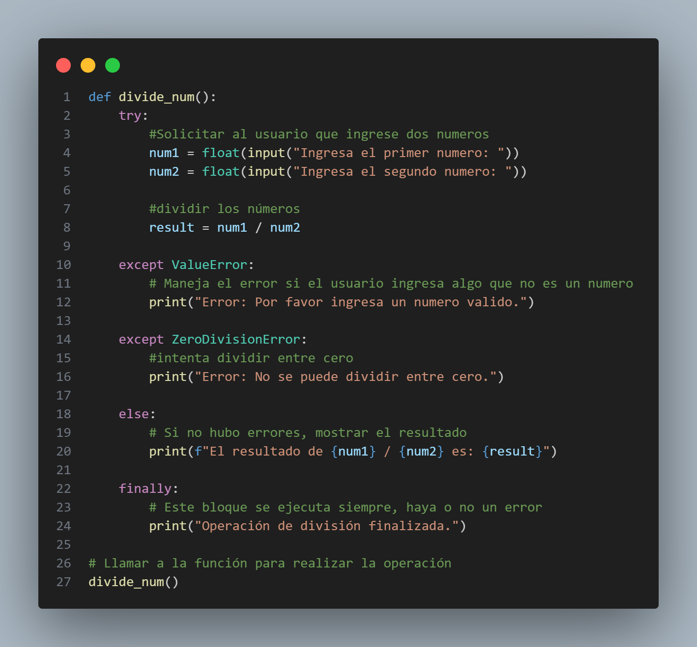
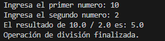
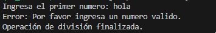
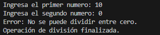

#
🧮 Manejo de Errores y Excepciones en Python

Este programa implementa una función llamada divide\_num() que solicita dos números al usuario, realiza una división y maneja los errores más comunes usando try, except, else y finally.

##
📌 Objetivo del programa

* Solicitar dos números al usuario.
* Intentar dividirlos.
* Manejar errores como:

&nbsp;	-Valores no numéricos (ValueError).

&nbsp;	-División entre cero (ZeroDivisionError).

* Mostrar siempre un mensaje final indicando que el proceso terminó.

##
🧠 ¿Qué demuestra este programa?

* Uso correcto de tolerancia a fallos.
* Uso de bloques:

&nbsp;	-try

&nbsp;	-except

&nbsp;	-else

&nbsp;	-finally

* Validación de entrada del usuario.

Prevención de fallos por malas entradas.

##
🧩 Código del programa

##
▶️ Cómo ejecutar el programa

1. Asegúrate de tener Python 3 instalado.
2. Guarda el archivo como division.py.
3. Ejecuta:

   python division.py
   
4. Ingresa los dos valores cuando se soliciten.

##
🧪 Ejemplos de uso
###
✔️ Entrada válida

###
❌ Error por entrada inválida

###
❌ Error por división entre cero

##
📄 Conclusión

Este programa demuestra cómo construir código tolerante a fallos, asegurando que el sistema continúe funcionando aun cuando el usuario introduzca errores. Implementa los conceptos básicos y esenciales para el manejo seguro de excepciones en Python.

